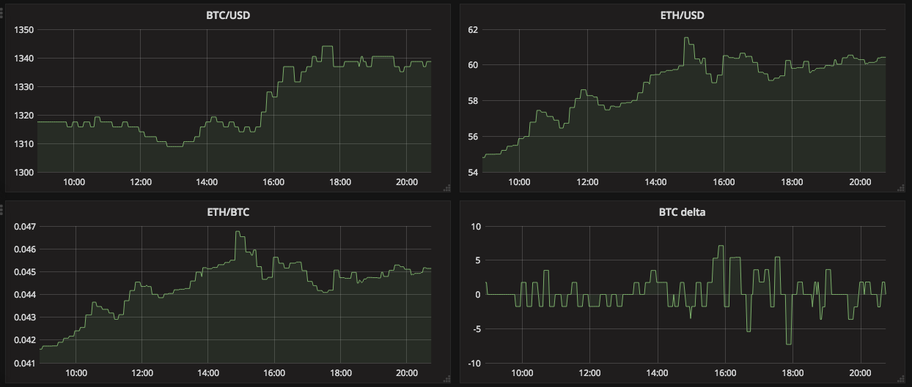
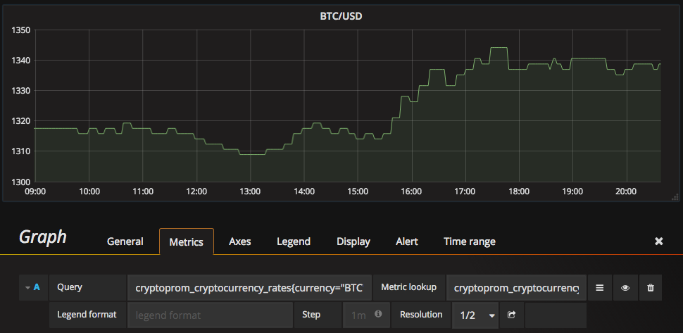
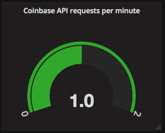

# Crypto::Prom

[](https://quay.io/repository/linki/cryptoprom)
[](https://github.com/linki/cryptoprom/releases)

CryptoProm is a Prometheus metrics exporter for Cryptocurrency market prices.

When you run it, it queries the Coinbase API once a minute to get the current
market price of Bitcoin and exports that data via HTTP so that Prometheus can
scrape it.

You can then use your favorite graphing tool, e.g. Grafana, to visualize the
data from Prometheus however you want.



## Setup

You need to install Ruby 2.4 and Bundler, however other versions might work as well. Then install dependent Gems via Bundler and start the Rack server.

You have to provide your Coinbase API credentials in order to retrieve data from their API:

```console
$ bundle install
$ export COINBASE_API_KEY="<your-api-key>"
$ export COINBASE_API_SECRET="<your-api-secret>"
$ rackup
```

Test that it works in a separate shell with curl:

```console
$ curl -sS localhost:9292/metrics | grep cryptoprom
...
cryptoprom_cryptocurrency_rates{currency="AUD",denominator="USD"} 0.7462686567164178
...
cryptoprom_cryptocurrency_rates{currency="BTC",denominator="USD"} 1335.113484646195
cryptoprom_cryptocurrency_rates{currency="ETH",denominator="USD"} 59.990017661061195
cryptoprom_cryptocurrency_rates{currency="EUR",denominator="USD"} 1.0869565217391304
cryptoprom_cryptocurrency_rates{currency="GBP",denominator="USD"} 1.282051282051282
...
cryptoprom_cryptocurrency_rates{currency="ZWL",denominator="USD"} 0.0031018331834113963
```

This is Prometheus syntax and shows you the current value of each
currency Coinbase knows about in USD, including BTC, ETH and various fiat currencies.

You can then use PromQL to query that data from Grafana. For instance, to create a
chart displaying the current BTC price in USD over time you could use the
following query:

```
cryptoprom_cryptocurrency_rates{currency="BTC"}
```

Which will result in the following graph:



You can also do more advances queries. The following takes both the BTC and ETH
prices in USD and relates them to each other. It basically shows what the "real"
price for ETH in BTC should be, when only given their prices in USD.

```
cryptoprom_cryptocurrency_rates{currency="ETH"} / ignoring(currency) cryptoprom_cryptocurrency_rates{currency="BTC"}
```

Last but not least, you can monitor CryptoProm itself. It exports metrics about
requests to its own metrics endpoint as well as its requests to the Coinbase API.

```
http_server_requests_total{code="200",method="get",path="/metrics"} 2.0
cryptoprom_coinbase_api_requests_total 14.0
```

You could use that to create a graph for CryptoProm's request rate against the
Coinbase API to validate that it behaves and you don't run into rate limiting
issues. You could create a Gauge in Grafana with the following PromQL query:

```
rate(cryptoprom_coinbase_api_requests_total[1h]) * 60
```

Which will display like this:



## Deploying

The `manifest` folder contains Kubernetes manifests that describe how CryptoProm
can be deployed. A Docker image can be found at `quay.io/linki/cryptoprom`.
